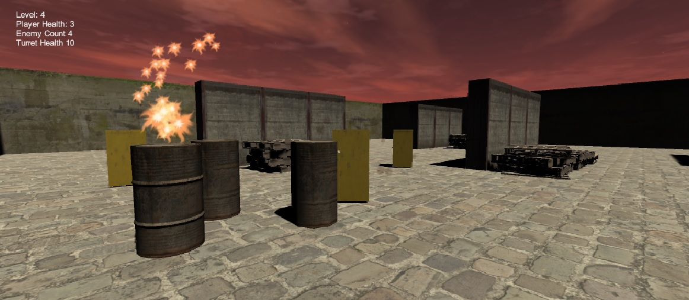

# FPS Demo

**FPS Demo** is a 3D first-person shooter prototype developed as part of the  
**University of the Cumberlands** course **ITSS-333: Video Game Programming**.

This project focuses on core FPS mechanics implemented in Unity, including player movement, camera control, shooting mechanics, and basic enemy interaction within a 3D environment.

---

## 🎓 Academic Context

- **Course:** ITSS-333 Video Game Programming  
- **Institution:** University of the Cumberlands  
- **Project Type:** Individual assignment  
- **Engine:** Unity (3D)

---

## 📸 Gameplay Screenshot

*In-game screenshot demonstrating first-person perspective and environment layout.*

---

## ⬇️ Download & Play

This game is available as a **Windows desktop build**:

👉 **Download Windows Binary:**  
https://www.cehost.com/fps_demo/fps.zip

Unzip the archive and run the executable to play.

---

## 🎮 Gameplay Features

- First-person camera and movement
- Keyboard and mouse controls
- Shooting mechanics
- 3D environment navigation
- Basic enemy or target interaction
- Physics-based collision handling

---

## 🧠 What This Project Demonstrates

- 3D game development fundamentals using **Unity**
- First-person controller implementation
- Input handling and camera control
- Scene composition and environment setup
- Applying object-oriented principles in **C#**

---

## 🛠️ Tech Stack

- **Unity (3D)**
- **C#**
- Unity Physics Engine
- Windows standalone build

---

## 📁 Repository Notes

This repository contains the full Unity project, including assets, scenes, scripts, and configuration files. Unity-generated and build artifacts are excluded using `.gitignore`.

---

## 🚀 Possible Enhancements

- Enemy AI and pathfinding
- Weapon variety and ammo system
- Sound effects and background music
- UI elements such as health and scoring
- Expanded level design

---

## 👤 Author

**Chris Chandler**  
Software Engineer  
GitHub: https://github.com/cgchandler
